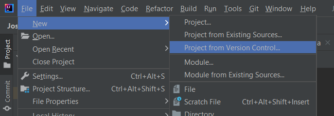
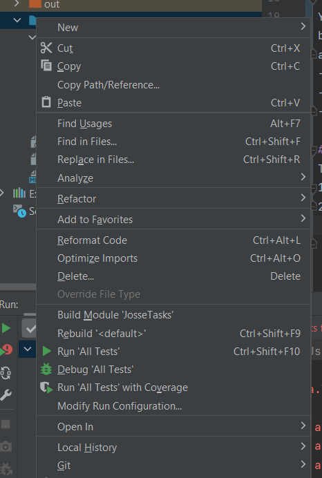

# JosseTasks
Task for Josse.

## How to start
Either download this as a zip, 
or learn how to use git 
(preferable, but you won't find it useful probably).
### How to use git
I am happy to walk you through it, but in nutshell:

and then you should be just able to input url.
There might be some issues with SSH though,
and we might need to make you an account on GitHub 
(exciting!, but probably not what you want now).

## Ok, I have it. What now?
There are some tasks for you:
- Learn about *classes*. 
You do not need to understand inheritance yet, 
but you need to know what `static` means 
and what is the difference between **object** and **class** is.
- Implement stuff in `Vector3` (in `src/natasha/Vector3.java`)
- If you are done, check your workings by running tests
- Let me know once you are done

## How do I run tests?
This is way easier if you have **IntelliJ**.
1. Right-click the `src` folder (or `tests`)
2. Select `Run all tests...

3. Initially, you should get loads of errors.
But if you implement your stuff you should see tick-marks appearing
4. Unless your code doesn't explode, 
tests should tell you what they expected.

You can look at the tests.
Let me know if you think the tests are wrong.